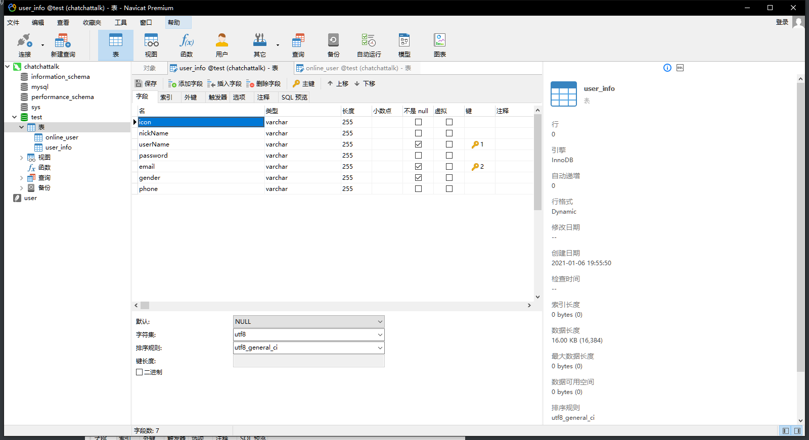

# ChatChatTalk 运行说明

## 第一组：组员情况

**胡文浩 18346019**

**冼子婷 18338072**

**廖雨轩 18322043**

## 项目编译和运行环境

- 操作系统 ：**Windows10**
- JAVA 编辑器：**IntelliJ IDEA 2020.4**
- JAVA 版本 ：**javaJDK 15.01 - java15**
- 依赖：**javaFX** **AnimateFX** commons-lang fontawesome jfoenix

> 编译运行参数与**依赖**已导入 IDEA，若出现编译问题请参照 javaFX 文档 https://openjfx.io/openjfx-docs/
>
> 或 CSDN https://blog.csdn.net/weixin_43616817/article/details/106668473 进行 IDEA 的配置

即选用**最新版的 JAVA SDK**，但是由于 javaFX 无法在**低版本 java** 下运行，并且需要**单独配置 javaFX**，环境可能比较复杂。

其中需要注意的点为：

- 需要在 IDEA 配置路径变量 PATH_TO_FX，值为**本机的 javaFX 路径**。

- Application ( Client 和 Server**都需要** ) 的**运行参数 VM options** 需要设置为：`--module-path ${PATH_TO_FX} --add-modules javafx.controls,javafx.fxml`

MySQL 功能由于**没有使用远端数据库和云服务器**，需要手动在"/src/Database/MySqlConnection.java"中，**手动修改数据库的用户和密码**，**且需要在该数据库新建两个表**，具体表信息在如下图片：

可使用 **Navicat** 等可视化数据库管理工具对数据库进行管理：

## 项目运行情况

