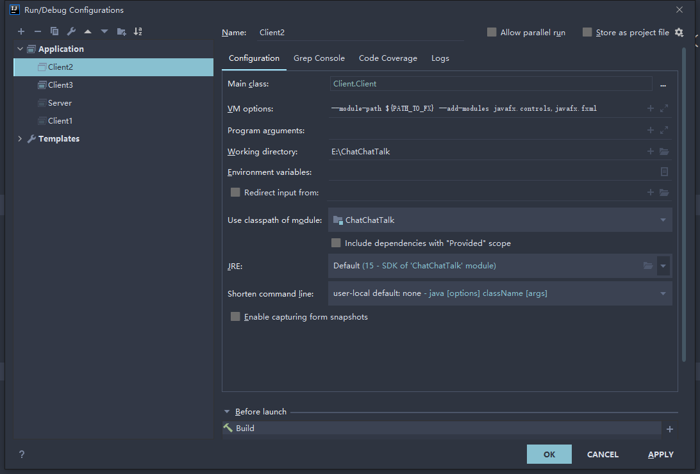
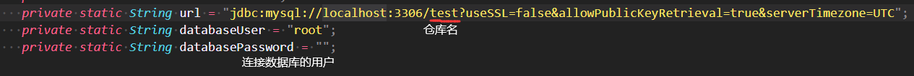
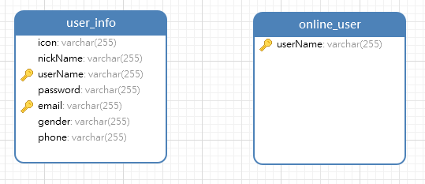

# ChatChatTalk 运行说明

## 第一组：组员情况

胡文浩 18346019

冼子婷 18338072

廖雨轩 18322043

## 编译环境

- 操作系统 ：Windows10
- JAVA 编辑器：IntelliJ IDEA 2020.4
- JAVA 版本 ：javaJDK 15.01 - java15
- 依赖：AnimateFX commons-lang fontawesome jfoenix

> 编译运行参数与依赖已导入 IDEA，若出现编译问题请参照 javaFX 文档 https://openjfx.io/openjfx-docs/ 或是 CSDN https://blog.csdn.net/weixin_43616817/article/details/106668473 进行 IDEA 的配置
> 

即选用最新版的 JAVA SDK，但是由于 javaFX 无法在低版本 java 下运行，并且需要单独配置，环境可能比较复杂。其中需要注意的点为，需要在 IDEA 配置路径变量 PATH_TO_FX，值为本机的 javaFX 路径。Application 的运行参数 VM options 需要设置为：`--module-path ${PATH_TO_FX} --add-modules javafx.controls,javafx.fxml`

MySQL功能由于没有使用远端数据库，需要手动在"/src/Database/MySqlConnection.java"中，手动修改数据库的用户和密码，且需要在该数据库新建两个表，具体表信息在如下图片
>
> 
>
> 
>
> 
>
> 