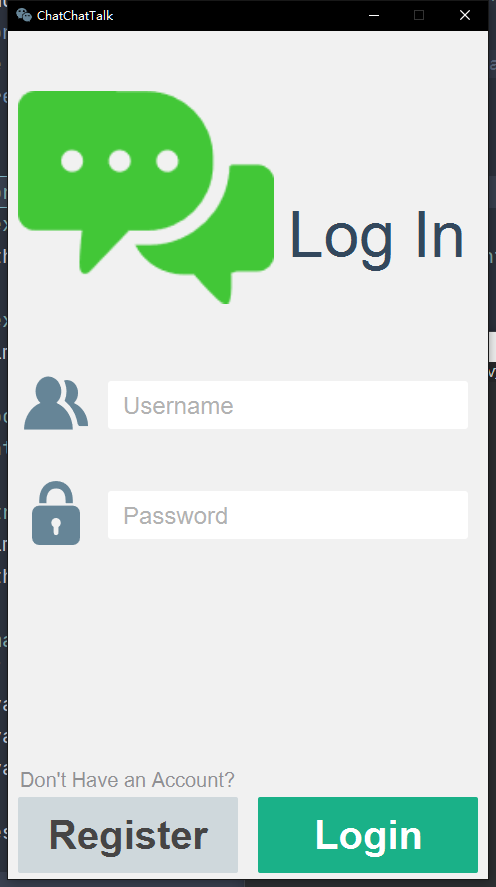
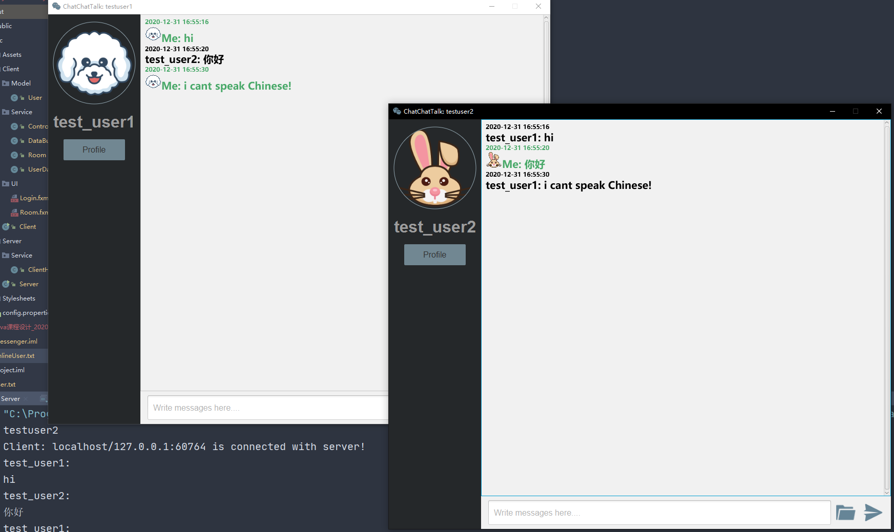
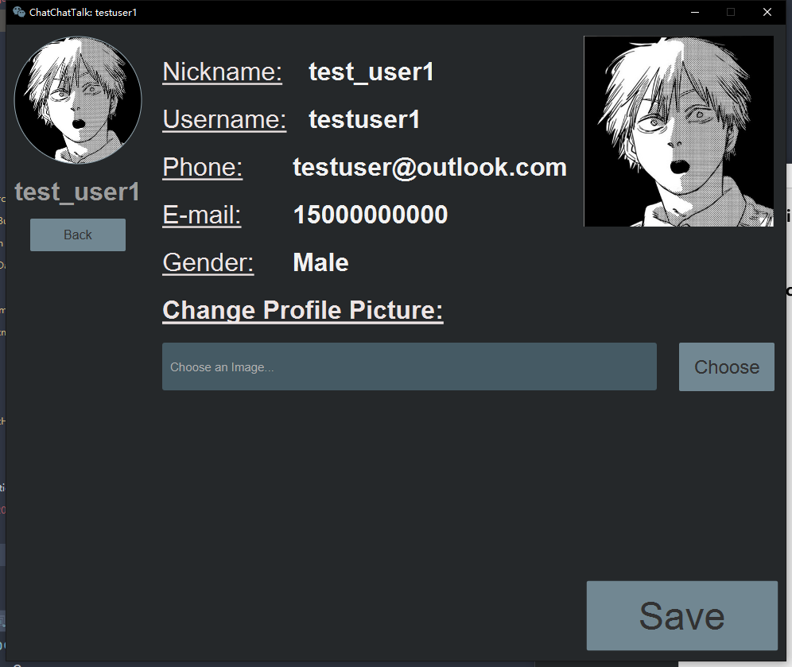
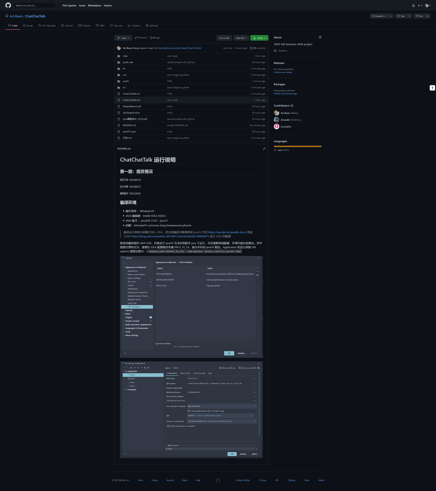

# ChatChatTalk

## 项目背景介绍

Chat Chat Talk 是一个使用 Java 语言编写的网络聊天室，此聊天室不仅实现了前后端分离，而且具有注册、登入、登出、群聊、更换头像、发送信息等功能。

Chat Chat Talk 的灵感来源于 web 课程的的登入登出作业、网络聊天室、日常生活中使用的各类聊天软件，以及 material design 的设计原则。

## 项目环境说明

- 操作系统 ：Windows10
- JAVA 编辑器：IntelliJ IDEA 2020.4
- JAVA 版本 ：javaJDK 15.01 - java15
- 依赖：AnimateFX commons-lang fontawesome jfoenix

> 编译运行参数与依赖已导入 IDEA，若出现编译问题请参照 javaFX 文档 https://openjfx.io/openjfx-docs/ 或是 CSDNhttps://blog.csdn.net/weixin_43616817/article/details/106668473 进行 IDEA 的配置

## 系统功能介绍

ChatChatTalk 主要有四个界面，分别为注册界面，登陆界面，聊天界面，更换及修改个人信息界面。

单击程序的运行按钮，自动跳转至登陆界面。

登陆界面有 Register 和 Login 的按钮：

- 已注册的用户可通过填写 Username 和 Password 一栏后，点击 Login 按钮完成登入，登入后自动跳转至聊天界面。
- 未注册用户，则需点击 Register 注册个人账户， 并在注册页面处完成 Nick Name , Username, Password, Email, Phone Number, Gender 处填写相应信息即可完成注册。

跳转至聊天界面后，可见左边黑色一览的 用户头像、用户名、Profile 按钮，以及右侧的聊天信息和聊天输入框。

- 单击 Profile 进入个人信息页面
- 单击头像即可更换头像
- 在修改个人信息处可以选择更换头像
- 在右侧聊天框输入信息后按下 enter 键 或 传送图标即可发出信息

发送信息后可在上方聊天区域看到其他进入聊天室用户的发送的消息和自己发送的消息，其中为了区分，自己发送的消息带有自己的头像且字体颜色为绿色。

当消息列表过长时，可通过拖动滚动条看到所有发送的消息。

## 项目结构说明

- 目录树：（等最后一个版本）

```bash
  .
  ├── .DS_Store
  ├── .git
  ├── .idea
  ├── Messenger.iml
  ├── Project.iml
  ├── lib
  │   ├── AnimateFX-1.2.0.jar
  │   ├── commons-lang3-3.11.jar
  │   ├── fontawesomefx-8.9.jar
  │   └── jfoenix-8.0.10.jar
  ├── onlineUser.txt
  ├── out
  ├── public
  │   ├── login.png
  │   ├── profile.png
  │   ├── registration.png
  │   └── room.png
  ├── src
  │   ├── Assets
  │   │   ├── Avatar
  │   │   │   ├── 1.png
  │   │   │   ├── 10.png
  │   │   │   ├── 11.png
  │   │   │   ├── 12.png
  │   │   │   ├── 13.png
  │   │   │   ├── 14.png
  │   │   │   ├── 15.png
  │   │   │   ├── 16.png
  │   │   │   ├── 17.png
  │   │   │   ├── 18.png
  │   │   │   ├── 19.png
  │   │   │   ├── 2.png
  │   │   │   ├── 20.png
  │   │   │   ├── 21.png
  │   │   │   ├── 22.png
  │   │   │   ├── 23.png
  │   │   │   ├── 24.png
  │   │   │   ├── 25.png
  │   │   │   ├── 26.png
  │   │   │   ├── 27.png
  │   │   │   ├── 28.png
  │   │   │   ├── 29.png
  │   │   │   ├── 3.png
  │   │   │   ├── 30.png
  │   │   │   ├── 31.png
  │   │   │   ├── 32.png
  │   │   │   ├── 4.png
  │   │   │   ├── 5.png
  │   │   │   ├── 6.png
  │   │   │   ├── 7.png
  │   │   │   ├── 8.png
  │   │   │   ├── 9.png
  │   │   │   ├── CITY
  │   │   │   │   ├── 1.png
  │   │   │   │   ├── 10.png
  │   │   │   │   ├── 11.png
  │   │   │   │   ├── 12.png
  │   │   │   │   ├── 2.png
  │   │   │   │   ├── 3.png
  │   │   │   │   ├── 4.png
  │   │   │   │   ├── 5.png
  │   │   │   │   ├── 6.png
  │   │   │   │   ├── 7.png
  │   │   │   │   ├── 8.png
  │   │   │   │   └── 9.png
  │   │   │   └── XMAS
  │   │   │   ├── 1.png
  │   │   │   ├── 10.png
  │   │   │   ├── 11.png
  │   │   │   ├── 12.png
  │   │   │   ├── 13.png
  │   │   │   ├── 14.png
  │   │   │   ├── 15.png
  │   │   │   ├── 16.png
  │   │   │   ├── 2.png
  │   │   │   ├── 3.png
  │   │   │   ├── 4.png
  │   │   │   ├── 5.png
  │   │   │   ├── 6.png
  │   │   │   ├── 7.png
  │   │   │   ├── 8.png
  │   │   │   └── 9.png
  │   │   ├── Chat.png
  │   │   ├── back.PNG
  │   │   ├── female.png
  │   │   ├── file.png
  │   │   ├── go_back.png
  │   │   ├── icons8-chat.png
  │   │   ├── icons8-facebook_messenger.png
  │   │   ├── icons8-sent.png
  │   │   ├── icons8-wechat.png
  │   │   ├── logo.png
  │   │   ├── man1.PNG
  │   │   ├── man2.PNG
  │   │   ├── messenger.PNG
  │   │   ├── password.png
  │   │   ├── registration.png
  │   │   ├── secure.png
  │   │   ├── user.png
  │   │   ├── username.png
  │   │   ├── video.PNG
  │   │   └── wechat.png
  │   ├── Client
  │   │   ├── Client.java
  │   │   ├── Model
  │   │   │   └── User.java
  │   │   ├── Service
  │   │   │   ├── Controller.java
  │   │   │   ├── DataBuffer.java
  │   │   │   ├── Room.java
  │   │   │   └── UserDataService.java
  │   │   └── UI
  │   │   ├── Login.fxml
  │   │   └── Room.fxml
  │   ├── Server
  │   │   ├── Server.java
  │   │   └── Service
  │   │   └── ClientHandler.java
  │   ├── Stylesheets
  │   │   └── style.css
  │   └── config.properties
  ├── user.txt
```

## 系统类图

（待导出）

## 关键模块说明

## 知识点应用说明

### 1. 类和对象

#### Server 服务端

```java
Server.Server

Server.Service
    Server.Service.ClientHandler
```

#### Client 客户端

```java
Client.Model
    Client.Modal.User

Client.Service
	Client.Service.Controller
     Client.Service.DataBuffer
     Client.Service.Room
     Client.Service.UserDataService

Client.UI
    Login.fxml
    Room.fxml

Client
```

### 2. 超类与继承

ClientHandler 继承了 Thread 类，不断监听客户端的接入。

Client 继承了 Application 类，使用 JavaFX 实现了图形界面。

### 3. 接口及其实现

UserDataService, User 实现了 Serializable 接口，采取序列化。

Room 实现了 Initializable 接口，对接 JavaFX 图形界面，进行联系与发送数据。

### 4. 异常处理

Server 进行对 ServerSocket 与 Socket 的异常处理，ClientHandler, UserDataService, DataBuffer 进行对输入输出流的异常处理

### 5. 多线程（待补充）

- [ ] （待补充）ClientHandler 采取多线程的方式？？

在 Room 中使用了 Platform.runlater 意味着如果需要从非 GUI 线程更新 GUI 组件，使用它将您的更新放在队列中，并且它将由 GUI 线程尽快处理。

### 6. 文件存储（待补充）

采取文件读写将已注册用户信息，在线用户写入本地

- [ ] 写聊天记录？

### 7. 网络编程

使用 ServeSocket 与 Socket 实现了网络聊天室

### 8. Java 图形界面

使用 [JavaFX](https://openjfx.io/) 实现 Java 图形界面，使用 Scene Builder 辅助设计，采取 Material Design 设计风格，引入了 AnimateFX, commons-lang, fontawesomefx, jfoenix 等库优化，美观图形界面。

> JavaFX 是一个开源的下一代客户端应用程序平台，适用于基于 Java 的桌面、移动端和嵌入式系统。

我们采取前后端分离的形式，由廖雨轩负责前端进行页面布局，CSS，FXML 的编写和与后台对接，由胡文浩负责后台接口的实现和与前端对接，由冼子婷负责产品的设计和文档的编写。







### 9. Java JDBC（待补充）

采用了Mysql数据库进行对用户的数据管理和存储，可在代码里面看出。

（截图）


## 创新点或技术难点说明（存在重复）

1. 使用 [JavaFX](https://openjfx.io/), Scene Builder, Material Design 实现 Java 图形界面，并且引入了 AnimateFX, commons-lang, fontawesomefx, jfoenix 等库优化，图形界面较为美观，更为现代。尽管如今用 java 做桌面平台应用以为少数，但我们认为在开源背景下的 javaFX 仍然有可用空间与前景。
2. 采取类似网络应用开发的前后端分离的形式，使用 git 进行版本管理，由廖雨轩负责前端进行页面布局，CSS，FXML 的编写和与后台对接，由胡文浩负责服务端的编写、后台接口的实现和与前端对接，由冼子婷负责客户端的编写、产品的设计和文档的编写。
3. 采用git进行版本管理，并且开源到github上，以下是我们github的截图



## 存在未解决的问题点或者难点讨论（施工中）

- [ ] 消息队列过多时，无法自动定位到最新的消息。00

> 解决方案：清空 textflow 的历史消息（需要每个用户保存聊天记录，可以采用文件存储方式写在本地 txt）
>
>  已知无法换成 textArea，且使用 ScrollPane 也无法解决

- [x] 无法显示他人头像

> 解决方案：需要在 User Model 加入头像类 ImageView

- [x] ~~无法使用中文路径、中文名称的头像~~（经测试可以）
- [x] 无法保存头像
- [x] 登录失败也会重复登录，已经登陆的提示不对，需要更改提示和错误类型
- [x] 退出没清空 onlineuser
- [x] ~~full name 只在简介出现而非用户界面与聊天室，登录实际上用的 username~~

> 已解决：聊天界面标题显示 username，头像下方为 nickname，聊天均采用 nickname

- [x] 升级 mysql 采用 Java JDBC
- [x] 清空无用的 system.out.println
- [ ] 文件群发功能还未实现 00
- [ ] 是否要为服务端写页面 00
